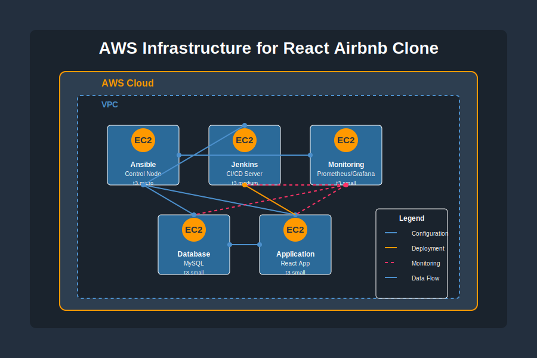

# React Airbnb Clone - DevOps Pipeline

Comprehensive CI/CD project for a React application using the latest DevOps tools.

## 📋 Project Description

This project contains a complete set of tools and configurations to run an automated CI/CD pipeline for a React application (Airbnb clone). It utilizes an AWS-based architecture with Jenkins servers, MySQL database, and Prometheus/Grafana monitoring system.

## 🏗️ Project Architecture

The project consists of the following components:

- **React Application**: Airbnb clone built in React
- **CI/CD Pipeline**: Automation of build, test, and deployment
- **Infrastructure**: Ansible scripts for server configuration
- **Containerization**: Dockerfile and Docker Compose
- **Monitoring**: Prometheus, Grafana, and SmokePing system
- **Security**: Trivy scanning and SonarQube code analysis

### AWS Infrastructure

The project requires the following AWS infrastructure:



- **Ansible Control Node**: Manages the configuration of all other servers
- **Jenkins Server**: Handles CI/CD processes (building, testing, deploying)
- **Monitoring Server**: Hosts Prometheus and Grafana for monitoring
- **Database Server**: Hosts MySQL database for the application
- **Application Server**: Runs containers with the React application

## 📁 Folder Structure

```
REACT-AIRBNB-CLONE/
├── src/                       # React application source code
├── infrastructure/            # Infrastructure configuration files
│   └── ansible/
│       ├── ansible.sh         # Ansible installation script
│       ├── inventory.yml      # Hosts configuration
│       └── playbooks/
│           ├── jenkins.yml    # Jenkins installation playbook
│           ├── database.yml   # Database installation playbook
│           └── monitoring.yml # Monitoring installation playbook
├── ci-cd/                     # CI/CD configuration
│   ├── Jenkinsfile            # Jenkins pipeline
│   ├── Dockerfile             # Docker configuration
│   ├── docker-compose.yml     # Docker services composition
│   └── app-setup.sh           # Application server configuration script
├── monitoring/                # Monitoring configuration
│   ├── prometheus.yml         # Prometheus configuration
│   └── grafana-dashboard-setup.sh # Grafana dashboard configuration script
└── docs/                      # Documentation
    ├── DeploymentGuide.md     # Deployment guide
    ├── Pipeline-architecture.mmd # Architecture diagram
    └── README.md              # This file
```

## 🚀 Deployment Phases

The project is divided into the following phases:

### Phase 1: Infrastructure Configuration
- Launch EC2 instances on AWS
- Install Ansible on the controller
- Configure servers (Jenkins, database, monitoring)

### Phase 2: CI/CD Configuration
- Install Jenkins plugins
- Configure tools (Docker, Node.js, Java)
- Set up the pipeline with Jenkinsfile

### Phase 3: Monitoring
- Configure Prometheus
- Set up Grafana dashboards
- Configure SmokePing

### Phase 4: Deployment
- Automated deployment through Jenkins
- Containerization with Docker
- Deployment verification

## 📋 Requirements

- AWS EC2 (min. 5 instances):
  1. **EC2 Ansible Control Node** - Ubuntu 22.04, t3.micro (2 vCPU, 1 GB RAM)
  2. **EC2 Jenkins** - Ubuntu 22.04, t3.medium (2 vCPU, 4 GB RAM)
  3. **EC2 Monitoring** - Ubuntu 22.04, t3.small (2 vCPU, 2 GB RAM)
  4. **EC2 Database** - Ubuntu 22.04, t3.small (2 vCPU, 2 GB RAM)
  5. **EC2 Application** - Ubuntu 22.04, t3.small (2 vCPU, 2 GB RAM)
- Appropriate AWS security groups allowing communication
- The same SSH key for access to all machines
- Docker Hub account

## 🛠️ Installation and Deployment

Complete installation instructions can be found in [DeploymentGuide.md](docs/DeploymentGuide.md).

### Infrastructure Preparation

1. Create all required EC2 instances in AWS according to the "Requirements" section
2. Configure security groups to enable communication between machines
3. Note the IP addresses of all machines

### Ansible Configuration

1. Clone this repository to the Ansible Control Node:
```bash
git clone https://github.com/your-username/react-airbnb-clone.git
cd react-airbnb-clone
```

2. Configure the Ansible server:
```bash
chmod +x infrastructure/ansible/ansible.sh
./infrastructure/ansible/ansible.sh
```

3. Update the inventory.yml file with the actual server IP addresses:
```bash
vi infrastructure/ansible/inventory.yml
```

4. Run Ansible playbooks to configure all servers:
```bash
cd infrastructure/ansible
ansible-playbook -i inventory.yml jenkins.yml
ansible-playbook -i inventory.yml monitoring.yml
ansible-playbook -i inventory.yml database.yml
```

### Jenkins Configuration

1. Access Jenkins via browser: http://jenkins-server-ip:8080
2. Install suggested plugins and additional ones mentioned in DeploymentGuide.md
3. Configure the pipeline by providing the path to the Git repository containing the Jenkinsfile

### Pipeline Execution

After configuration is complete, Jenkins will automatically:
1. Fetch code from the repository
2. Install dependencies
3. Run unit tests
4. Perform SonarQube code analysis
5. Scan for security with Trivy
6. Build Docker image
7. Deploy to the application server

## 📊 Monitoring

The monitoring system is based on:

- **Prometheus**: Metrics collection
- **Grafana**: Data visualization
- **Node Exporter**: System metrics
- **SmokePing**: Availability monitoring

Dashboard access:
- Grafana: http://monitoring-server-ip:3000
- Prometheus: http://monitoring-server-ip:9090

## 🔒 Security

The pipeline includes automatic security scanning:

- **Trivy**: Docker image scanning
- **SonarQube**: Static code analysis
- **OWASP Dependency-Check**: Dependency checking

## 📝 License

[MIT](LICENSE)

## 👨‍💻 Author

Michal-DevOps

---

*Documentation created for the React-Airbnb-Clone CI/CD Pipeline project, 2025*
